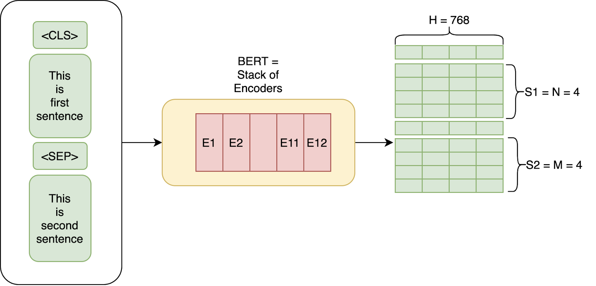
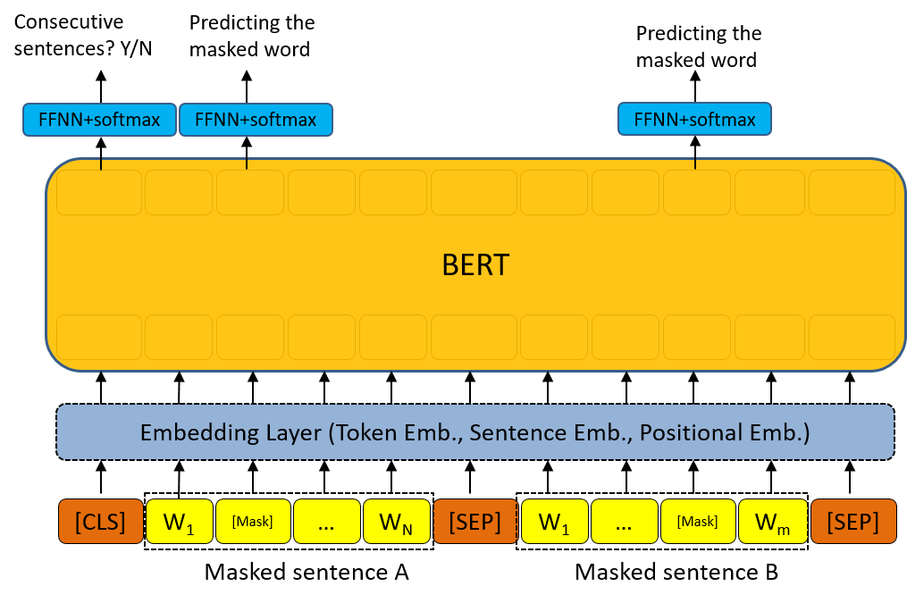
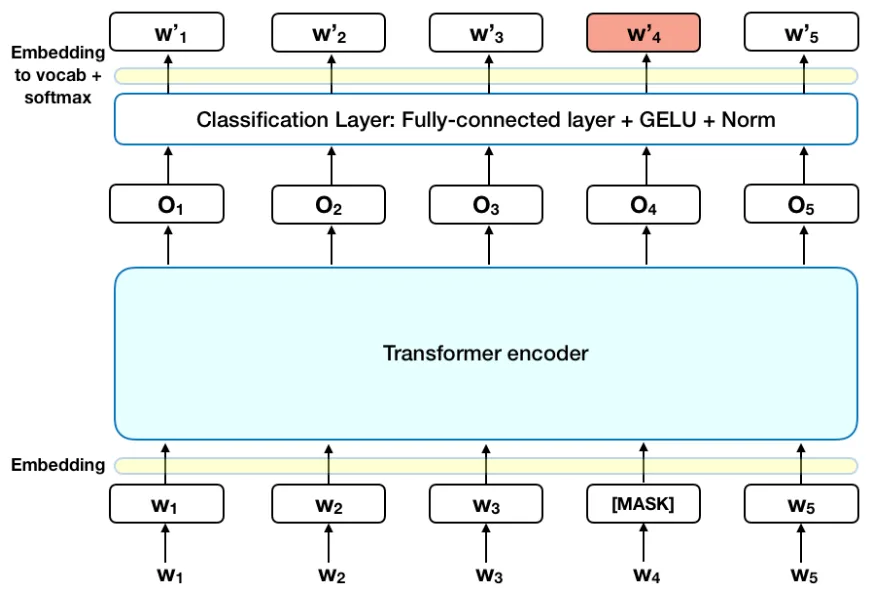
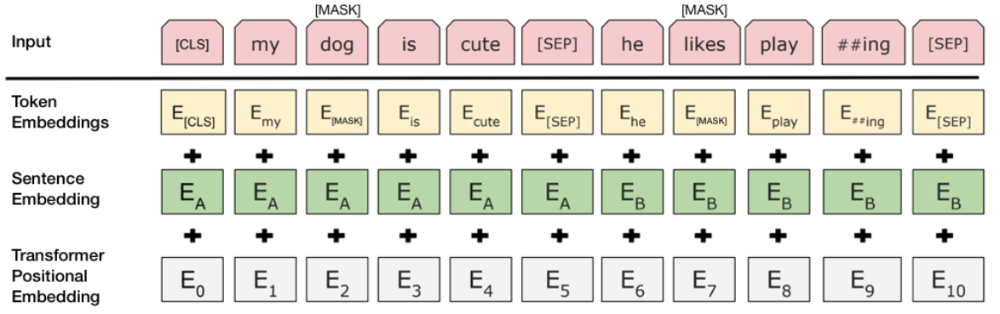

<h1>
Complete BERT Architecture 
</h1>

This repository aims to provide a complete and detailed implementation of a BERT (Bidirectional Encoder Representations from Transformers) architecture from scratch. BERT is a bidirectional language model that has revolutionized the field of natural language processing (NLP) by enabling deeper and more contextualized understanding of text. Our primary focus is not on creating a high-precision model for immediate practical applications, but rather on providing a deep and detailed understanding of the various components and mechanisms that make up a Transformers architecture. The idea is that by exploring this repository, you will be able to develop a solid foundation of knowledge about how these models work internally. This includes building embeddings, operating attention layers, working feed-forward mechanisms, and pre-training strategies. Rather than focusing on achieving state-of-the-art performance on specific NLP tasks, this project emphasizes education and theoretical and practical understanding of the fundamental concepts. This approach is especially valuable for students, researchers, and hobbyists who want to dive deeper into the details of the BERT architecture and understand how to implement a Transformers model from scratch.  
I hope this repository serves as a robust educational resource, allowing users to learn and experiment with the BERT architecture in a hands-on and detailed manner, without the pressure of immediately achieving high-accuracy results that require large amounts of data and substantial computational resources.  

<a href="https://arxiv.org/abs/1810.04805">Link to original paper</a>  
 

Some points that we will cover in this repository:

* **Creating Data Batches and Applying Special Tokens**
* **Creating Attention Masks**
* **Model Construction**
* **Embedding Module**
* **Scaled Dot Product Attention Module**
* **Multi-Head Attention Module**
* **Positional Feedforward Module**
* **Encoder Layer Module**
* **LLM Architecture (BERT Model)**
* **Training**

 
<h2>Creating Data Batches and Applying Special Tokens</h2>

The make_batch function creates batches of data for training the BERT model. It is responsible for generating the correct input required for training BERT, which includes the input tokens, the masked tokens, the positions of the masked tokens, the segment IDs, and a label indicating whether the second sentence immediately follows the first.

- **Initialization**: The function starts by initializing an empty batch and counters for positive and negative sentences. Positive sentences are pairs of sentences where the second sentence immediately follows the first, while negative sentences are pairs where this does not happen. The batch should be balanced between positive and negative sentences.

- **Generation of sentence pairs**: For each instance in the batch, the function randomly selects two sentences from the dataset. Each sentence is then converted to a list of token IDs, and the special tokens [CLS] and [SEP] are added in the appropriate places.

- **Segment IDs**: For each pair of sentences, the function generates segment IDs, which are 0 for tokens in the first sentence and 1 for tokens in the second sentence.

- **Masked Language Model (MLM)**: The function then randomly selects 15% of the tokens to mask for the MLM task, ensuring that the [CLS] and [SEP] tokens are not masked. These tokens are either replaced with the [MASK] token, a random token, or left unchanged, depending on a random draw.

- **Padding**: The function adds padding to the input IDs, segment IDs, masked tokens, and masked positions to ensure that all lists are the same length.

- **Next Sentence Prediction**: Finally, the function checks whether the second statement immediately follows the first. If so, it adds a True label to the instance and increments the positives counter. If not, it adds a False label and increments the negatives counter.

This function continues generating instances until the batch is full and contains an equal amount of positive and negative instances. The batch is then returned.
Note that this function is just an example of how data can be prepared for BERT training. Depending on the dataset and the specific task, you may need to adjust this function.

<h2>Creating Attention Masks</h2>

 
The get_attn_pad_masked function creates an attention mask for padding tokens in a sequence.

- **Inputs**: The function accepts two sequences, seq_q and seq_k. These are typically the query sequence and the key sequence in an attention operation.

- **Size extraction**: The function extracts the batch size and sequence lengths (len_q and len_k) from the dimensions of the input sequences.

- **Creating the mask**: The attention mask is created by checking which elements in seq_k are equal to zero (which indicates a padding token). This produces a boolean array of the same size as seq_k, where True indicates a padding token and False indicates an actual token.

- **Adding a dimension**: The dimension is added to the mask using the unsqueeze(1) method, which adds an extra dimension at index 1. This is necessary because the attention mask must have the same dimension as the attention matrices in the Transformer.

- **Mask expansion**: Finally, the mask is expanded to have the same size as the attention matrix, which has dimensions (batch_size, len_q, len_k). The expanded mask is returned by the function.

 
In short, the function creates a mask that can be used to prevent the model from paying attention to padding tokens when calculating attention. Padding tokens are used to pad sequences so that they are all the same length, but they don't carry any useful information, so it's important to make sure the model ignores them.

<h2>Model Construction</h2>

 
The image below is a high-level description of the Transformer encoder. The input is a sequence of tokens, which are first embodied into vectors and then processed in the neural network. The output is a sequence of vectors of size H, where each vector corresponds to an input token with the same index.

In technical terms, predicting output words requires:

- **1-** Add a classification layer on top of the encoder output.
- **2-** Multiply the output vectors by the embedding matrix, transforming them into the vocabulary dimension.
- **3-** Calculate the probability of each word in the vocabulary with softmax.

 
The loss function in the BERT model only considers the prediction of masked values ​​and ignores the prediction of unmasked words. As a consequence, the model converges more slowly than directional models, a characteristic that is compensated by its greater context awareness.

 
In the BERT training process, the model is given sentence pairs as input and learns to predict whether the second sentence in the pair is the subsequent sentence in the original document. During training, 50% of the inputs are a pair where the second sentence is the subsequent sentence in the original document, while for the other 50% a random sentence from the corpus is chosen as the second sentence.

To help the model distinguish between the two sentences being trained, the input is processed as follows before entering the model:

- **1-** A [CLS] token is inserted at the beginning of the first sentence and a [SEP] token is inserted at the end of each sentence.
- **2-** A sentence embedding indicating either Sentence A or Sentence B is added to each token. Sentence embeddings are similar in concept to token embeddings with a vocabulary of 2.
- **3-** A positional embedding is added to each token to indicate its position in the sequence. The concept and implementation of positional embedding are presented in the Transformer article.

In fact, the embedding used to train the model is a combination of several embeddings.

<h2>Embedding Module</h2>

The Embedding class is part of the BERT architecture. Individual components of the class:

- **Initialization (def init(self))**: The class constructor initializes the components needed for the embeddings.

- **self.tok_embed**: This is the token embedding layer that maps each token to a d_model dimension vector.

- **self.pos_embed**: This is the position embedding layer that maps the position of a token within a sequence to a vector of dimension d_model.

- **self.seg_embed**: Segment embedding layer that maps the token type (0 for the first sentence and 1 for the second sentence) to a vector of dimension d_model.

- **self.norm**: Layer normalization component that is used to normalize the embedding vectors.

Forward Method (def forward(self, x, seg)): The forward method is where the actual embedding happens.

- First, it calculates the position of each token in the sequence.
- It then creates an array of positions in the same shape as the input x using pos.unsqueeze(0).expand_as(x).
- Then it calculates the total embedding as the sum of the token, position and segment embeddings.
- Finally, it normalizes the embedding using the normalization layer and returns the result.

A combinação dessas três embeddings permite ao BERT levar em consideração tanto o significado individual dos tokens quanto a ordem em que aparecem na sequência, bem como se o token pertence à primeira ou à segunda sentença. Isso torna a embedding do BERT muito poderosa e flexível.

<h2>Scaled Dot Product Attention Module</h2>

Here we will implement the Scaled Dot-Product Attention mechanism, which is a key part of the Transformer model used in BERT and other natural language processing models.

- **Scores**: The dot product of Q (query matrix) and K (key matrix) is calculated to determine the score for each key-query pair. These scores determine how well each element of the input sequence must be satisfied in producing the output representation for a given element. The score is then scaled by the square root of the dimension of the keys (d_k) to prevent the dot product values ​​from becoming too large in high-dimensional environments.

- **Attention Mask**: The attention mask is applied to the scores by padding the locations where the mask has a value of 1 with a very large negative number (-1e9). This ensures that these locations receive a weight close to zero when softmax is applied.

- **Softmax**: The softmax function is applied to the last axis of the scores to obtain the attention weights. This ensures that all weights are positive and sum to 1, so they can be interpreted as probabilities.

- **Context**: The attention weights are then multiplied by the value matrix V(value) to get the output of the attention mechanism. Each value is weighted by the amount we should "attend" to that value, as determined by the attention weights.

The method returns the context (the weighted output) and the attention matrix.

In the Transformer model, Normalized Dot Product Attention is used multiple times in each layer, allowing the model to pay attention to different parts of the input when producing each element of the output. This allows the Transformer to effectively handle long-range dependencies between words in the input sequences.

<h2>Multi-Head Attention Module</h2>

Implementation of Multi-Head Attention, which is a key component of the Transformer architecture used in models like BERT. The idea behind multi-head attention is to apply normalized dot product attention multiple times in parallel, each with different learned weights. This allows the model to focus on different positions and capture different types of information.

- **Initialization**: residual and batch_size are initialized with Q and the size of the first axis of Q, respectively. The residual will be used later for the residual connection path.

- **Linear Transformations**: We apply linear transformations to the input data (Q, K, and V) using different weights. These transformations generate multiple attention "heads".

- **Remodeling**: The outputs of these linear transformations are then reshaped and transposed to have the appropriate form for normalized dot product attention.

- **Attention Mask**: The attention mask is adjusted to match the shape of the attention heads.

- **Normalized Dot Product Attention**: Normalized dot product attention is then applied to each of the attention heads.

- **Context Reshaping**: The output (context) of each attention head is then reshaped and concatenated.

- **Linear Transformation and Normalization**: A linear transformation is applied to the concatenated context, followed by a layer normalization.

- **Residual Connection**: The final result is obtained by adding the output of the layer normalization to the residual connection path (original input Q).

Finally, the function returns the normalized output and the attention matrix. Multi-head attention allows the model to consider information from different parts of the input sequence, in different representation subspaces, at the same time, which improves the model's ability to capture multiple features of the text.

<h2>Positional Feedforward Module</h2>

This is the implementation of the Positional Feedforward Network (PoswiseFeedForward), which is a component of the Transformer architecture, used in models such as BERT.
The Positional Feedforward Network is composed of two linear layers with a GELU (Gaussian Error Linear Unit) activation between them.

- **First Linear Layer (self.fc1)**:The input x is passed through a linear layer (also called a fully connected layer). This layer has a linear transformation with d_model inputs and d_ff outputs, where d_model is the dimension of the embedding space and d_ff is the dimension of the hidden layer of the feed-forward network. This allows the model to learn non-linear representations.

- **GELU Activation**: Next, GELU activation is applied. The GELU function allows the model to learn more complex, non-linear transformations. It helps deal with the vanishing gradient problem by allowing more information to pass through the network.

- **Second Linear Layer (self.fc2)**: Finally, the output of the GELU activation is passed through a second linear layer, which transforms the output back to the original d_model dimension. This is done so that the output of this feedforward network can be summed with the original input (residual connection) in the Transformer.

The return of the function is therefore the output of this second linear layer, which has undergone the transformation of the first linear layer, GELU activation, and second linear layer.
Positional feed-forward networks are an important part of Transformer models, allowing them to learn more complex representations and perform non-linear transformations of the input data.

<h2>Encoder Layer Module</h2>

This class defines an EncoderLayer, which is a component of the Transformer architecture and is also used in models like BERT. Each encoder layer in the Transformer contains two sublayers: a Multi-Head Attention layer and a Positional Feed-Forward Network.

- **Multi-Head Attention (self.enc_self_attn)**: The enc_inputs input is passed through a Multi-Head Attention layer, which is used to ensure that each word in the input receives attention from all other words. This layer also receives a mask (enc_self_attn_mask), which is used to prevent the model from paying attention to certain words (such as filler words). The output of Multi-Head Attention is another sequence of vector representations, with the same dimension as the input. The attention matrix that shows how each word has been paid attention to all the others is also returned.

- **Positional Feed-Forward Network (self.pos_ffn)**: The output of the Multi-Head Attention layer then passes through a Positional Feed-Forward Network. This is a simple neural network that operates independently on each position in the sequence (i.e. the same network is applied to each position). This allows the model to learn more complex representations and perform non-linear transformations of the data.

The function returns the output of this encoder layer, which is the output of the Positional Feed-Forward Network, along with the attention matrix. Therefore, the input and output of this encoder layer have the same dimension, which allows multiple such encoder layers to be stacked to form the full Transformer encoder.

<h2>Final LLM Architecture (BERT Model)</h2>

This class defines the BERT (Bidirectional Encoder Representations from Transformers) model, a state-of-the-art language model that uses transformers and bidirectional attention to understand the semantics of words within a context.

- **Embedding (self.embedding)**: Transforms the inputs (input_ids and segment_ids) into dense vectors (embeddings).

- **Attention Mask (get_attn_pad_masked)**: Generates an attention mask to ignore pad tokens in inputs.

- **Coding Layers (self.layers)**: It passes the output of the embedding and the attention mask through multiple encoder layers. Each encoder layer is composed of a multi-head attention layer and a positional feed-forward network.

- **Pooling (self.activ1(self.fc(output[:, 0])))**: Applies a fully connected layer and a hyperbolic tangent activation to the first position (the classification token) of each sequence in the encoder output. This results in a sequence representation vector.

- **Classifier (self.classifier)**: A fully connected layer that outputs the logits for the next sentence classification task.

- **Masked Token Extraction (torch.gather(output, 1, masked_pos))**: Select the output vectors corresponding to the masked tokens.

- **Masked Tokens Transformation (self.norm(self.activ2(self.linear(h_masked))))**: Applies a linear transformation, a GELU activation and normalization to the output of the masked tokens.

- **Decoder (self.decoder)**: A linear layer that generates the logits for the masked language modeling task. It uses the same weights as the token embedding layer for consistency across the representation space. This decoder function is only used to generate the final logits and is not used in the model learning process.

The method returns the logits for the masked language modeling task and the next sentence classification task. These logits can then be used to calculate the losses for both tasks during training.

<h2>Training</h2>

The typical one-epoch training cycle in a machine learning model. Let's break it down into steps:

- **optimizer.zero_grad()**: Resets the gradients of all optimized variables. This is done because gradients in PyTorch are cumulative, meaning that each time we call .backward(), the gradients are added together instead of being replaced. So, we need to clear these accumulated gradients before each optimization step.

- **logits_lm, logits_clsf = model(input_ids, segment_ids, masked_pos)**: Feed the input data into the model and get the output from the model. The output is composed of logits_lm and logits_clsf, which are the raw unnormalized results for the language modeling task and the classification task, respectively.

- **loss_lm = criterion(logits_lm.transpose(1,2), masked_tokens)**: Computes the loss of the masked language modeling task. criterion is the loss function, logits_lm.transpose(1,2) are the model predictions, and masked_tokens are the ground truth targets.

- **loss_lm = (loss_lm.float()).mean()**: Converts the loss to a floating point data type (if it isn't already) and then averages the loss.

- **loss_clsf = criterion(logits_clsf, isNext)**: Calculates the loss of the next sentence classification task.

- **loss = loss_lm + loss_clsf**: Combines the two losses into a single scalar loss.

- **loss.backward()**: Computes the gradients of all optimized variables. Gradients are computed with respect to the loss.

- **optimizer.step()**: Updates the model parameters using the calculated gradients.

These steps are repeated for each training epoch. Each epoch is a complete cycle through the training set. Therefore, if NUM_EPOCHS is 10, then the complete training process is executed 10 times.

<h2>Final considerations</h2>

Implementing a Transformer architecture, especially large-scale models like BERT, requires a massive amount of data and significant computational power for training. This repository is not intended to train a full-fledged large-scale language model (LLM), but rather to provide a solid foundation for understanding the fundamentals and structure of such models.

Please feel free to contribute, open issues, and participate in discussions to further improve this educational project.

